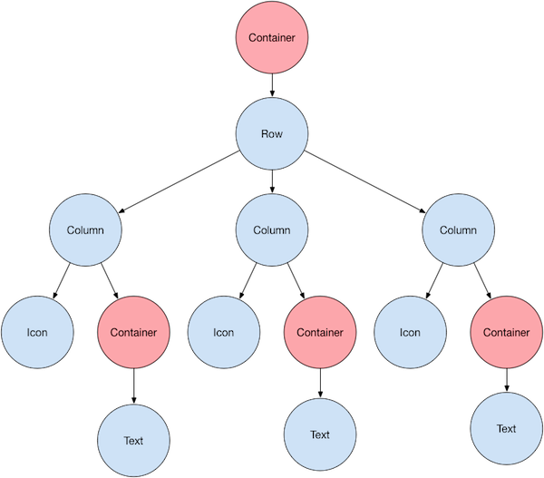
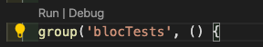
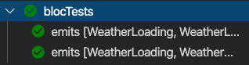

# Flutter state management

## Why state management?

Flutter apps consist of widgets. A widget can have multiple child widgets, so an app quickly becomes a tree-like structure of widgets depending on other widgets. 



Data can be shared across multiple widgets, which quickly becomes painful to pass along through each constructor. With a state management solution, the data becomes accessible from anywhere in the app. So instead of having a widget holding data solely to pass it along, the data now only lives in the widgets that actually use it. When data changes that require a UI element to rebuild, only the widget and its child widgets will be rebuilt, rather than everything in between the widget mutating the data and the widget displaying it. This makes developing easier and increases performance.


## <b>Popular state management approaches:</b>
* Provider
* BloC Pattern/Rx
* Scoped Model
* Redux
* MobX

## <b>Provider</b>

* Little setup needed
* Easy to understand
* Efficient way of rebuilding UI
* Very popular approach, so there's a lot of documentation
* Needs to have its Consumer type declared (safe, but restricting)

<b>Installation:</b>
```yaml
dependencies:
  flutter:
    sdk: flutter
  provider: ^3.0.0
```
```dart
import 'package:provider/provider.dart';
```

Here we provide the `Counter()` model to `MyApp()`. `ChangeNotifierProvider` will rebuild the UI everytime `Counter()` changes.
`Counter()` is initialized inside the builder, making Provider take care of Counter's lifecycle, so it will call `dispose()` when `Counter()` isn't needed anymore.
```dart
void main() => runApp(
  ChangeNotifierProvider(
    create: (context) => Counter(), 
    child: MyApp(),
  ),
);
```

<b>`Counter` model:</b>

```dart
class Counter with ChangeNotifier {
  int value = 0;

  void increment() {
    value += 1;
    notifyListeners();
  }
}
```
Inside `increment`, `notifyListeners()` is called. This will let our `ChangeNotifierProvider` know that it needs to rebuild the UI element it's listening to.


<b>Ui element:</b>

```dart
Column(
  mainAxisAlignment: MainAxisAlignment.center,
  children: <Widget>[
    Text('You have pushed the button this many times:'),
    Consumer<Counter>(
      builder: (context, counter, child) => Text(
        '${counter.value}',
        style: Theme.of(context).textTheme.display1,
      ),
    ),
  ],
);
```
Here a `Consumer()` is used with type `Counter`. Provider needs to know the type to know which element to rebuild. The `context`, <b>instance</b> of `Counter` and an optional `child` Widget are passed into the `Text()` widget, which is rebuilt every time `notifyListeners()` is called within `Counter`'s `increment()` function.

<b>Ui element:</b>
```dart
floatingActionButton: FloatingActionButton(
  onPressed: () =>
    Provider.of<Counter>(context, listen: false).increment(),
    tooltip: 'Increment',
    child: Icon(Icons.add),
),
```
This is the button which calls the `increment()` function. `Provider.of` is another way to access the model object held by an ancestor `Provider`. This will also listen to changes in the model by default and rebuilds the whole widget when notified.
`listen: false` makes sure that the previous mentioned behaviour is disabled. Without it, it would rebuild `MyHomepage` entirely. We only need to access `increment()` here, our `Consumer` will take care of rebuilding the `Text()` widget.
</br>

# BloC - overview

BloC: Business logic component

BloC is a pattern very similar to Redux the way it's used in React. It was created by Google and announced at Google I/O 2018. There is a BloC library that implements the `InheritedWidget` under the hood, and also makes passing state along the widget tree much more intuitive.  The BloC lives between the UI that consumes the data, and the source (e.g. an API response) that delivers the data.

BloC creates a very explicit one-way data flow that is clearly divided into three steps:
* <i>Event</i>: Something happens, e.g.: a user pushes a button
* <i>BLOC</i>: The event is dispatched to the block, which will create the next state and omit it to
* <i>The stream</i>: Which we can listen to in our UI so it will be rebuilt once data changes.
 
<b>Installation</b>
```yaml
dev_dependencies:
  flutter_test:
    sdk: flutter
  bloc: ^3.0.0
  flutter_bloc: ^3.1.0
```
</br>

<b>counter_bloc.dart:</b>

The event is an `enum` that is handled by the switch-case in `mapEventToState()`.
`mapEventToState()` returns a `Stream` of the state, the count, and takes in events (increment or decrement).

```dart
import 'dart:async';
import 'package:bloc/bloc.dart';

enum CounterEvent { increment, decrement }

class CounterBloc extends Bloc<CounterEvent, int> {
  @override
  int get initialState => 0;

  @override
  Stream<int> mapEventToState(CounterEvent event) async* {
    switch (event) {
      case CounterEvent.decrement:
        yield state - 1;
        break;
      case CounterEvent.increment:
        yield state + 1;
        break;
    }
  }
}
```
</br>

<b>main.dart:</b>

Here, we wrap the `CounterPage` in a `BlocProvider` that serves the `CounterBloc`, giving the `CounterPage` access to `CounterEvent.increment` and `CounterEvent.decrement`, as well as the count data.
```dart
void main() => runApp(MyApp());

class MyApp extends StatelessWidget {
  @override
  Widget build(BuildContext context) {
    return MaterialApp(
      title: 'Flutter Demo',
      home: BlocProvider<CounterBloc>(
        create: (context) => CounterBloc(),
        child: CounterPage(),
      ),
    );
  }
}
```
</br>
<b>counter_page.dart:</b>

`counterBloc` is available because `CounterPage` inside `main.dart` was wrapped with a `BlockProvider`.

```dart
import 'package:flutter/material.dart';
import 'package:flutter_bloc/flutter_bloc.dart';

import 'counter_bloc.dart';

class CounterPage extends StatelessWidget {
  @override
  Widget build(BuildContext context) {

    final CounterBloc counterBloc = BlocProvider.of<CounterBloc>(context);

    return Scaffold(
      ...
      body: BlocBuilder<CounterBloc, int>(
        builder: (context, count) {
          return Center(
            child: Text(
              '$count',
              style: TextStyle(fontSize: 24.0),
            ),
        }
      floatingActionButton: ...
      onPressed: () {
                counterBloc.add(CounterEvent.increment);
              },
              ...
              onPressed: () {
                counterBloc.add(CounterEvent.decrement);
              },
      
      ),
    );
```
<br/>


## BLoC - A more complex implementation

### Weather application

I'm using [this repository]('https://github.com/ResoCoder/bloc-test-library-tutorial.git') as an example on how to handle more complex state. This also shows a good approach on how to structure the `bloc`, `state` and `events`. It also features unit tests using `bloc_test` and `mockito`.

### Event
Events are the input to a Bloc. Can be as simple as an enum, or a class on its own.

### States
State is the output of a Bloc and represents <b>a part</b> of the application's state. UI components can be notified of states and redraw (portions of) themselves.

### Transitions
The change from one state to another. A Transition consists of the current state, the event and the next state. 
`onTransition` is a method that can be overridden to handle every local Bloc's `Transition`. `onTransition` is called just before a Bloc's `state` has been updated. An instance of `Transition` stores the `currentState`, `nextState` and the `event`.
It's possible to gather all `Transitions` in one place.

### Streams
A sequence of asynchronous data.

### Blocs
Business Logic Component. A component which converts a `Stream` of incoming `Events` into a `Stream` of outgoing `States`. Always extends the base `Bloc` class from the core package. A Bloc has to define an initial state. It must also implement a function called `mapEventToState`.
The current bloc state is accessible through the `state` property. Duplicate states are ignored.
The `add()` method of a Bloc takes an `event` and triggers `mapEventToState`. `Events` are handled in order of which they were added and can be enqueued.


`onError` is a method that can be overridden to handle every local Bloc `Exception`.

### BlocBuilder
`BlocBuilder` is a Flutter widget from the `flutter_bloc` package. `BlocBuilder` handles building the widget in response to new states. The `builder` function can be called many times, so it needs to be a pure function.
Note: if the `bloc` parameter is omitted, `BlocBuilder` will automatically perform a lookup using `BlocProvider` and the current `BuildContext`.

### BlocProvider
`BlocProvider` is a Flutter widget which provides a bloc to its children via `BlocProvider.of<T>(context)`. It's used as a dependency injection widget so that a single instance of a bloc can be provided to multiple widgets within a subtree. `BlocProvider` is also used to create new blocs and it automatically handles closing the bloc.

If `BlocProvider` is used to inject an existing `bloc`, it will not handle automatically closing it (as it didn't create it).

### MultiBlocProvider
`MultiBlocProvider` merges multiple `BlocProviders` into one. `MultiBlocProvider` improves readability and eleminates nesting multiple `BlocProviders`.

## Weather app flow

This example app uses a data model, `weather.dart`, which is a basic Dart class extended with `Equatable`, which makes comparing objects easier. The data source is the `weather_repository.dart`, which contains two fetch methods that return a `Future` of `Weather` model (based on randomly generating a temperature). 

The bloc layer is split up in three parts:
* `weather_bloc.dart`, the bloc that handles events and outputs states.
* `weather_event.dart`, a set of basic Dart classes: `FetchedWeather` and `FetchedDetailedWeather`.
* `weather_state.dart`, a set of basic Dart classes: `WeatherInitial`, `WeatherLoadSuccess`, `WeatherLoadInProgress` and `WeatherError`.

### Snippets


### `weather_event.dart`

The `WeatherEvent` has one field: `cityName`, by which it is fetched.

```dart
abstract class WeatherEvent extends Equatable {
  const WeatherEvent();
}

class FetchedWeather extends WeatherEvent {
  final String cityName;

  const FetchedWeather(this.cityName);

  @override
  List<Object> get props => [cityName];
}
```

### `weather_state.dart`

```dart
abstract class WeatherState extends Equatable {
  const WeatherState();
}
...
class WeatherLoadSuccess extends WeatherState {
  final Weather weather;
  const WeatherLoadSuccess(this.weather);
  @override
  List<Object> get props => [weather];
}
```
### `weather_bloc.dart`
```dart
class WeatherBloc extends Bloc<WeatherEvent, WeatherState> {
  final WeatherRepository weatherRepository;

  WeatherBloc(this.weatherRepository);

  @override
  WeatherState get initialState => WeatherInitial();

  @override
  Stream<WeatherState> mapEventToState(
    WeatherEvent event,
  ) async* {
    yield WeatherLoadInProgress();
    ...
    if (event is FetchedWeather) {
      try {
        final weather = await weatherRepository.fetchWeather(event.cityName);
        yield WeatherLoadSuccess(weather);
      } on NetworkError {
        yield WeatherError("Couldn't fetch weather. Is the device online?");
      }
    }
    ...
  }
}
```

### `weather_search_page.dart`
```dart
...
child: BlocBuilder<WeatherBloc, WeatherState>(
  builder: (context, state) {
    if (state is WeatherInitial) {
      return buildInitialInput();
    }
  }
),
...
```


# Testing
Bloc makes testing very straight forward. It requires the following package:
```yaml
dev_dependencies:
  bloc_test: ^3.0.0
```
<i>Note: `bloc_test` depends on `mockito`, `meta`, `rxdart`, `test` as well as `bloc` itself.</i>

## blocTest - generics

First of all, the `WeatherRepository` is mocked with the Mockito package.
```dart
class MockWeatherRepository extends Mock implements WeatherRepository {}
```
As usual with unit testing, there is a `setUp` and `tearDown` method. These are run before and after every unit test, respectively. These are optional. In our case, we only need the `setUp` method. Before each test the mocked `WeatherRepository` is instantiated.
```dart
setUp(() {
  mockWeatherRepository = MockWeatherRepository();
});
```

## The blocTest case
The blocTest has a `description`, a `build` method, the `act` method (where the `event` is added to the `bloc`) and the expected outcome, in this case a series of `states`.

```dart
blocTest(
  'emits [WeatherLoading, WeatherLoaded] when successful',
  build: () {
    when(mockWeatherRepository.fetchWeather(any))
        .thenAnswer((_) async => weather);
    return WeatherBloc(mockWeatherRepository);
  },
  act: (bloc) => bloc.add(FetchedWeather('London')),
  expect: [
    WeatherInitial(),
    WeatherLoadInProgress(),
    WeatherLoadSuccess(weather),
  ],
);
```

## Testing bloc dependencies

To test code that depends on other `blocs`, or `blocs` that depend on other `blocs`, we can mock our `bloc`. First of all, we create a Mock class:

```dart
class MockWeatherBloc extends MockBloc<WeatherEvent, WeatherState>
    implements WeatherBloc {}
```

Which is instatiated inside the `setUp()` method:

```dart
setUp(() {
  mockWeatherBloc = MockWeatherBloc();
});
```
In this test case, the `expectLater()` function is used. The difference between that and a regular `expect()` is that this returns a `Future` that that completes when the matcher has finished matching.
```dart
test('Example mocked BLoC test', () {
  whenListen(
    mockWeatherBloc,
    Stream.fromIterable([WeatherInitial(), WeatherLoadInProgress()]),
  );

  expectLater(
    mockWeatherBloc,
    emitsInOrder([WeatherInitial(), WeatherLoadInProgress()]),
  );
});
```

## Test groups

Test cases can be grouped by using `group()`. These just feature a description and the unit tests themselves. This can be particulary useful when combined with an IDE like Visual Studio Code. Here is an example of a group:

```dart
group('blocTests', () {
  // Your tests go here
});
```
Inside the IDE, it now gives you the ability to run/debug test groups from within the code files.



And the test output is also grouped by the IDE:




# Conventions

## Naming conventions

The BloC Documentation writes the following on naming conventions:

### Events

<i><quote>Events should be named in the past tense because events are things that have already occurred from the bloc's perspective.</quote></i>

Good examples: `CounterStarted`, `CounterIncremented`, `CounterDecremented`, `CounterIncrementRetried`

Bad examples: `Initial`, `CounterInitialized`, `Increment`, `DoIncrement`, `IncrementCounter`

### State

<i><quote>States should be nouns because a state is just a snapshot at a particular point in time.</quote></i>

Good examples: `CounterInitial`, `CounterLoadSuccess`, `CounterLoadInProgress`

Bad examples: `Initial`, `Loading`, `Success`, `Succeeded`, `Loaded`, `Failure`, `Failed`

</br>
</br>

# MobX


<b>The user fires an action, which mutates an observable, that notifies a reaction.</b>

### Observables
 Observables represent the reactive state. Like Redux, MobX uses a `Store` to collect the related `observable` state under one class.

### Actions

Actions define how the `observable` is mutated. Actions do not mutate them directly. An action adds a semantic meaning to the mutations. In the Counter example, an action would be `increment()` rather than `counter++`.

The `observable` is only notified upon the completion of the `action`.

### Reactions

Whenever an `observable` is changed, a `reaction` is notified (e.g. to rebuild the UI). A nice feature of `reaction` is that it automatically tracks all the `observables` without any explicit code. The act of reading an `observable` within a reaction is enough to track it.

<i>Note:</i>
The package `mobx_codegen` allows the use of annotations to mark fields/functions as `@observable` or `@action`.

 <b>Installation:</b>
 ```yaml
 dependencies:
  flutter:
    sdk: flutter
  mobx: ^0.4.0
  flutter_mobx: ^0.3.4
 ```

 ```yaml
dev_dependencies:
  flutter_test:
    sdk: flutter
  build_runner: ^1.3.1
  mobx_codegen: ^0.3.11
 ```


### Store

```dart
import 'package:mobx/mobx.dart';

part 'counter.g.dart';

class Counter = _Counter with _$Counter;

abstract class _Counter with Store {
  @observable
  int value = 0;

  @action
  void increment() {
    value++;
  }
}
```
The abstract class `_Counter` includes the `Store` mixin. Using `flutter packages pub run build_runner build`, we generate a file named `counter.g.dart`. To do this automatically we can make the builder watch, using this command: `flutter packages pub run build_runner watch`.

The generated `counter.g.dart` looks like this:

```dart
// GENERATED CODE - DO NOT MODIFY BY HAND

part of 'counter.dart';

// **************************************************************************
// StoreGenerator
// **************************************************************************

// ignore_for_file: non_constant_identifier_names, unnecessary_lambdas, prefer_expression_function_bodies, lines_longer_than_80_chars, avoid_as, avoid_annotating_with_dynamic

mixin _$Counter on _Counter, Store {
  final _$valueAtom = Atom(name: '_Counter.value');

  @override
  int get value {
    _$valueAtom.context.enforceReadPolicy(_$valueAtom);
    _$valueAtom.reportObserved();
    return super.value;
  }

  @override
  set value(int value) {
    _$valueAtom.context.conditionallyRunInAction(() {
      super.value = value;
      _$valueAtom.reportChanged();
    }, _$valueAtom, name: '${_$valueAtom.name}_set');
  }

  final _$_CounterActionController = ActionController(name: '_Counter');

  @override
  void increment() {
    final _$actionInfo = _$_CounterActionController.startAction();
    try {
      return super.increment();
    } finally {
      _$_CounterActionController.endAction(_$actionInfo);
    }
  }
}
```

### `main.dart`
```dart
import 'package:flutter/material.dart';
import 'package:flutter_mobx/flutter_mobx.dart';
import './counter.dart';

// Instantiate the store
final counter = Counter();

...
// inside build method:
Observer(
  builder: (_) => Text(
    '${counter.value}',
    style: Theme.of(context).textTheme.display1,
  ),
),
...
```
The `Text()` widget is wrapped in an `Observer` with a builder function. This makes sure the `Text()` widget is notified on changes.
